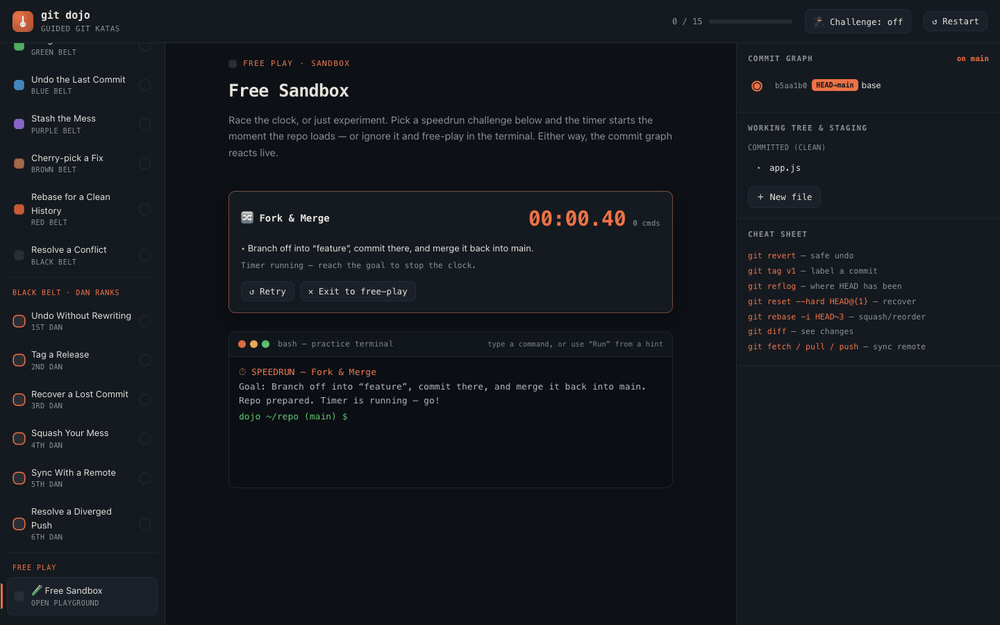

# 🥋 Git Dojo

[](https://github.com/shaqa3/git-dojo)
[](LICENSE)

**▶ Play it live: https://shaqa3.github.io/git-dojo/**

[](https://shaqa3.github.io/git-dojo/)

<sub>▲ A “Fork & Merge” speedrun, solved live — typed commands, a reacting commit graph, and the timer stopping on success.</sub>

An interactive, **fully offline** trainer for learning Git by doing. Practice real
commands in a simulated terminal, watch a live commit graph react, and progress
through 15 guided katas — then race the clock in the speedrun sandbox.

There is **no AI/LLM and no network access** at runtime. The "git" behind the
terminal is a deterministic JavaScript simulator (`src/git-engine.js`) that is
unit-tested; the whole app ships as a single self-contained HTML file.

## Quick start

Open the built file directly in any browser — no server, no dependencies:

```bash
npm run build        # writes dist/git-dojo.html
open dist/git-dojo.html   # macOS (or just double-click the file)
```

`dist/git-dojo.html` is standalone: you can email it, host it on any static
server, or open it from disk offline.

## What's inside

- **9 belt katas** — first commit, staging, branching, merging, reset, stash,
  cherry-pick, rebase, and resolving a merge conflict.
- **6 black-belt "Dan" katas** — revert, tags, reflog recovery, interactive-rebase
  squash, remote sync (fetch/pull/push), and a diverged-push resolution.
- **Speedrun sandbox** — 6 timed challenges with a live timer, command counter,
  and personal bests saved to `localStorage`.
- **Interactive rebase modal** (pick / reword / squash / fixup / drop / reorder),
  a **diff viewer**, tags & remote refs on the graph, and a **challenge mode**
  that hides the hints.

Supported commands include `init, add, status, commit, branch, checkout, switch,
merge, reset, restore, log, stash, cherry-pick, rebase (+ -i), tag, revert,
reflog, diff, remote, fetch, push, pull`, plus shell helpers (`echo >`, `touch`,
`cat`, `ls`, `rm`, `clear`).

## Project layout

```
git-dojo/
├── src/
│   ├── git-engine.js   # the tested git simulator (source of truth)
│   └── ui.html         # UI shell + katas + speedrun; /*__ENGINE__*/ marks the inject point
├── build.js            # inlines the engine into the UI -> dist/git-dojo.html
├── dist/
│   └── git-dojo.html   # built, self-contained app (the deliverable)
└── test/
    ├── engine.test.js  # 36 unit tests for core commands
    ├── advanced.test.js# 46 unit tests for tags/revert/reflog/diff/rebase-i/remotes
    ├── kata-sim.js      # drives every kata to completion via its own hints
    └── dom-smoke.js     # boots the real bundle under a stub DOM (no throws + speedrun)
```

## Development

Edit `src/git-engine.js` (logic) or `src/ui.html` (interface/katas), then:

```bash
npm test     # build + run engine tests, kata simulation, and the DOM smoke test
npm run build
```

The engine is developed test-first: `test/engine.test.js` and
`test/advanced.test.js` exercise it directly in Node. `kata-sim.js` extracts the
real kata definitions from the built HTML and confirms each one is completable by
its suggested commands. `dom-smoke.js` executes the shipped bundle against a
minimal stub DOM to catch render-time errors and to run the full speedrun
lifecycle. All four must pass before shipping.

## Contributing

Contributions are welcome — bug fixes, new katas, new speedrun challenges, or new
simulated commands. The project is intentionally **dependency-free**: no runtime
libraries, no build framework, just Node for the tests and `build.js`.

**Ground rules**

- Never hand-edit `dist/git-dojo.html` — it's generated. Change `src/` and run
  `npm run build`.
- `npm test` must pass before you open a PR. If you change the engine or add a
  kata/challenge, add or update a test that covers it.
- Match the surrounding style: small functions, no dependencies, and keep the
  single-file, offline-first design intact (no network calls at runtime).

**Common changes**

- **Add a git command** — implement `cmd_<name>` in `src/git-engine.js`, register
  it in the dispatcher table, and cover it in `test/advanced.test.js`.
- **Add a kata** — append an entry to the `KATAS` array in `src/ui.html` with a
  `setup(repo)` and an array of `steps`, each having a `check(repo)` predicate.
  `test/kata-sim.js` will verify it is completable from its own hints.
- **Add a speedrun challenge** — append to the `CHALLENGES` array in `src/ui.html`
  with a `goal(repo)` predicate; the DOM smoke test confirms it's solvable.

**Workflow**

```bash
git switch -c my-change
# edit src/…, then:
npm test           # build + all suites must be green
git commit -am "Describe your change"
# open a pull request against main
```

Bug reports and ideas are equally welcome — please
[open an issue](https://github.com/shaqa3/git-dojo/issues).

## License

Released under the [MIT License](LICENSE).
